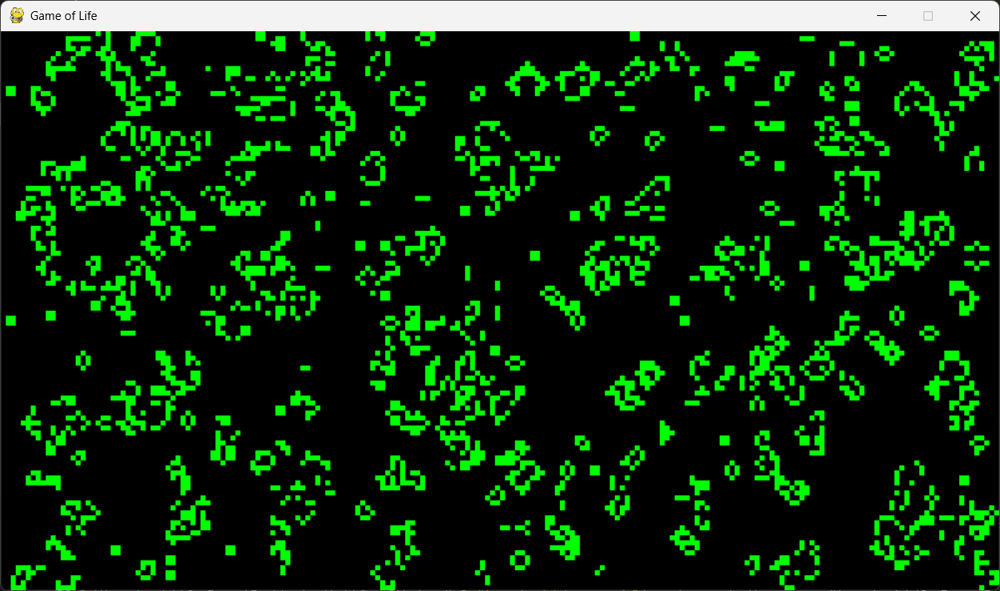

# Game of Life on Pygame

This is an implementation of the "Game of Life" using the `pygame` library for graphical visualization.



## Running the program

1. Clone the repository or download the project.
2. Install dependencies:
   ```bash
   pip install -r requirements.txt
   ```
3. Run the program:
   ```bash
   python main.py
   ```
